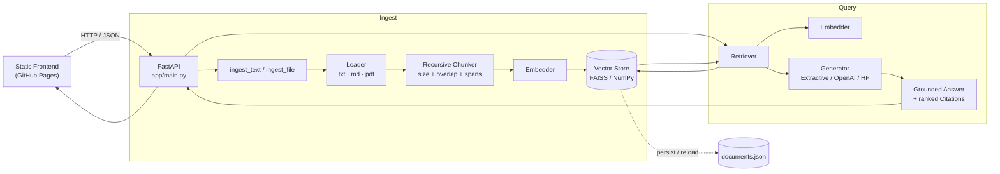

# 01 · Vanilla RAG

> A **from-scratch** Retrieval-Augmented Generation service — no LangChain, no LlamaIndex,
> no hidden magic. Document in → chunk → embed → vector search → **grounded answer with
> citations**. Runs fully offline out of the box and upgrades to real transformer
> embeddings + FAISS + an LLM through environment config alone.

Project **01** of a 50-project AI Engineering portfolio. The goal of this repo is to
show the *entire* RAG loop implemented transparently, so every stage can be read,
tested, and reasoned about.

---

## Overview

Vanilla RAG is a FastAPI service plus a static web UI that answers questions **grounded
in your own documents**. You ingest text/Markdown/PDF, the service splits it into
overlapping chunks, embeds them into vectors, stores them in a vector index, and at query
time retrieves the most similar passages and composes a cited answer.

It is deliberately dependency-light: with **only the core requirements installed** it runs
end-to-end using a deterministic hashing embedder, an exact NumPy cosine index, and an
extractive generator — **no API keys, no model downloads, no network**. Install the ML
extra and it transparently switches to real `sentence-transformers` embeddings and a FAISS
index; add an LLM key and it switches to real generative answers.

## Problem

Most "RAG" tutorials hide the interesting parts inside frameworks. When retrieval quality
is poor, or an answer is subtly ungrounded, you can't tell *why* — the chunking, embedding,
similarity math, and prompt assembly are all black boxes. This project removes the black
boxes: every stage is a small, readable, individually-tested module.

## Real-World Use Case

A **self-serve policy assistant**: upload a company's refund/support/warranty policy and HR
handbook, then let employees or customers ask natural-language questions and get answers
that quote the exact source passage. The bundled synthetic sample data (Acme refund policy +
remote-work handbook) demonstrates exactly this. The same shape fits developer docs,
compliance knowledge bases, product manuals, and internal wikis.

## Architecture



**Provider abstractions** (swap via env vars, no code changes):

```
Embedder            → SentenceTransformerEmbedder | HashingEmbedder
VectorStore         → FaissStore | NumpyStore
LLMProvider         → ExtractiveProvider | OpenAIProvider | HuggingFaceProvider
```

## Features

- **Real recursive chunking** with a separator hierarchy (paragraph → line → sentence →
  word → hard cut), configurable size + **overlap**, and exact character spans for citations.
- **Two embedding backends**: production `sentence-transformers` (semantic) and a
  deterministic, offline **feature-hashing** embedder (zero deps) — with stopword filtering
  for clean lexical signal.
- **Two vector stores**: exact NumPy cosine and **FAISS** `IndexFlatIP`, behind one interface,
  with **filtered retrieval** (`source_filter`).
- **Grounded answers with inline `[n]` citations** mapped to ranked source passages + scores.
- **Three generation providers**: offline **extractive** (default), **OpenAI**, **Hugging Face**.
- **Persistence**: documents/chunks saved to JSON and **re-embedded on boot** (index format is
  independent of the embedding backend, so you can switch backends safely).
- **PDF, Markdown, TXT** ingestion; multipart file upload.
- **FastAPI** with auto OpenAPI docs (`/docs`), CORS, health endpoint, and real error handling
  (empty retrieval is a graceful result, malformed input is a `422`).
- **Static web UI** with clickable citations, source highlighting, and live pipeline introspection.
- **39 passing tests**, `ruff`-clean, Docker + GitHub Actions CI.

## Tech Stack

| Layer | Technology |
|---|---|
| API | Python 3.11, FastAPI, Uvicorn, Pydantic v2, pydantic-settings |
| Retrieval | NumPy (exact cosine), FAISS (`faiss-cpu`, optional) |
| Embeddings | `sentence-transformers` (optional, real) · built-in hashing embedder (offline) |
| Generation | Extractive (offline) · OpenAI SDK · Hugging Face `InferenceClient` (optional) |
| Loaders | `pypdf` for PDF; stdlib for text |
| Frontend | Vanilla HTML/CSS/JS (no build step → GitHub Pages ready) |
| Quality | pytest, ruff, GitHub Actions |
| Packaging | Docker, docker-compose |

## Project Structure

```
01-vanilla-rag/
├── app/
│   ├── api/routes.py            # /health /ingest/text /ingest/file /query /documents
│   ├── core/config.py           # pydantic-settings env config
│   ├── core/logging.py
│   ├── schemas/rag.py           # request/response models (incl. Citation)
│   ├── services/
│   │   ├── chunking.py          # recursive splitter + overlap + spans
│   │   ├── embeddings.py        # Embedder: SentenceTransformer | Hashing
│   │   ├── vector_store.py      # VectorStore: FAISS | NumPy
│   │   ├── retrieval.py         # embed query -> ranked results
│   │   ├── generation.py        # LLMProvider: Extractive | OpenAI | HF
│   │   ├── loaders.py           # txt/md/pdf -> text
│   │   ├── text_utils.py        # tokenizer + stopwords
│   │   └── rag_pipeline.py      # orchestrator + persistence
│   ├── data/                    # synthetic sample documents
│   └── main.py                  # FastAPI app
├── frontend/                    # static UI (GitHub Pages)
├── scripts/seed.py              # offline index seeder
├── tests/                       # 39 tests (offline, deterministic)
├── Dockerfile  docker-compose.yml  .dockerignore
├── requirements*.txt  pyproject.toml  .env.example  .gitignore
└── .github/workflows/ci.yml
```

## Installation

```bash
git clone https://github.com/deepvisionkararhaider-crypto/01-vanilla-rag.git
cd 01-vanilla-rag
python -m venv .venv
# Windows: .venv\Scripts\activate     macOS/Linux: source .venv/bin/activate

# Core (runs fully offline with the hashing embedder + numpy store):
pip install -r requirements.txt

# Optional — real semantic embeddings + FAISS:
pip install -r requirements-ml.txt

# Optional — dev/CI tooling:
pip install -r requirements-dev.txt
```

## Environment Variables

Copy `.env.example` to `.env` and adjust. **Never commit `.env`.**

| Variable | Default | Meaning |
|---|---|---|
| `EMBEDDING_PROVIDER` | `auto` | `auto` \| `hashing` \| `sentence-transformers` |
| `EMBEDDING_MODEL_NAME` | `all-MiniLM-L6-v2` | HF model used by the transformer embedder |
| `VECTOR_STORE` | `auto` | `auto` \| `numpy` \| `faiss` |
| `CHUNK_SIZE` / `CHUNK_OVERLAP` | `800` / `120` | chunking parameters (chars) |
| `TOP_K` | `4` | passages retrieved per query |
| `LLM_PROVIDER` | `extractive` | `extractive` \| `openai` \| `huggingface` |
| `OPENAI_API_KEY` / `OPENAI_MODEL` | *(empty)* / `gpt-4o-mini` | only if `LLM_PROVIDER=openai` |
| `HUGGINGFACE_API_KEY` / `HUGGINGFACE_MODEL` | *(empty)* | only if `LLM_PROVIDER=huggingface` |
| `CORS_ORIGINS` | `*` | comma-separated allowed origins |
| `DATA_DIR` / `INDEX_DIR` | `./data` / `./index` | persistence locations |

## Running Locally

```bash
# 1) (optional) seed the index with the bundled sample documents
python scripts/seed.py

# 2) start the API
uvicorn app.main:app --reload --port 8000
#    -> API:      http://localhost:8000
#    -> Swagger:  http://localhost:8000/docs
#    -> Health:   http://localhost:8000/health

# 3) serve the frontend (separate terminal)
cd frontend && python -m http.server 5500
#    -> UI: http://localhost:5500   (set "Backend API URL" to http://localhost:8000)
```

## API Documentation

Interactive OpenAPI docs are served at **`/docs`** (Swagger UI) and `/redoc`.

| Method | Path | Description |
|---|---|---|
| `GET` | `/health` | Liveness + active pipeline config, doc/chunk counts |
| `POST` | `/ingest/text` | Ingest raw text `{text, source_id?, metadata?}` |
| `POST` | `/ingest/file` | Multipart upload of `.txt`/`.md`/`.pdf` |
| `POST` | `/query` | `{question, top_k?, source_filter?}` → cited answer |
| `GET` | `/documents` | List ingested documents and chunk counts |

## Example

```bash
# Ingest
curl -X POST http://localhost:8000/ingest/text \
  -H "Content-Type: application/json" \
  -d '{"text":"Refunds are available within 30 days of purchase for standard plans. Contact support with your order number to request a refund.","source_id":"acme-policy"}'

# Query
curl -X POST http://localhost:8000/query \
  -H "Content-Type: application/json" \
  -d '{"question":"How many days do I have to request a refund?","top_k":2}'
```

Response (extractive provider, hashing embedder — actual output from this repo):

```json
{
  "question": "How many days do I have to request a refund?",
  "answer": "Based on the retrieved documents: Refunds are available within 30 days of purchase for standard plans. [1] Contact support with your order number to request a refund. [1]",
  "citations": [
    {"chunk_id": "…::0", "source_id": "acme-policy", "chunk_index": 0,
     "score": 0.265687, "text": "Refunds are available within 30 days …"}
  ],
  "llm_provider": "extractive",
  "retrieved": 1,
  "timings_ms": {"retrieval": 0.19, "generation": 0.11, "total": 0.31}
}
```

## Evaluation

This repo does **not** claim benchmark numbers it hasn't measured. What is actually
verified by the automated suite (`pytest`, 39 tests):

- **Retrieval correctness** — a refund question retrieves refund passages; `source_filter`
  restricts results to one document; results are ordered by descending cosine score.
- **Groundedness** — every answer carries `[n]` markers that map to returned citations.
- **Robustness** — empty index → graceful "no evidence" answer (not an error); blank input →
  `400`; missing/invalid fields → `422`.
- **Determinism** — the hashing embedder is reproducible across processes; embeddings are
  L2-normalized so inner product == cosine.

A quantitative RAG benchmark (faithfulness / answer-relevance / context-precision, e.g. via
RAGAS) is a planned addition — see *Future Improvements*. **No evaluation scores are
fabricated here.**

## Performance

Measured on this machine (Windows, Python 3.11, **hashing** embedder, **NumPy** store,
tiny 1–10 chunk corpus) — indicative only, **not** a scaled benchmark:

- Query end-to-end: **~0.3 ms** (retrieval ~0.19 ms + generation ~0.11 ms) for a 1-chunk index.
- Full test suite (39 tests): **~0.35 s**.

Latency with `sentence-transformers` is dominated by model encode time and first-run model
download; **not benchmarked at scale yet.**

## Docker

```bash
# Core image (offline hashing embedder + numpy store)
docker build -t vanilla-rag .

# Image with real transformer embeddings + FAISS
docker build --build-arg INSTALL_ML=true -t vanilla-rag:ml .

# Run
docker run --rm -p 8000:8000 vanilla-rag
# or with compose (persistent volume + healthcheck)
docker compose up --build
```

> **Build status in this portfolio environment:** the Dockerfile and compose file are
> complete, but the image was **not built here** because the Docker daemon (Docker Desktop)
> was not running on the build machine. It is a standard `python:3.11-slim` image and is
> expected to build unchanged on any host with a running Docker daemon.

## Deployment

- **Frontend → GitHub Pages (LIVE).** The `frontend/` directory is a static site published
  to GitHub Pages. Because Pages serves static files only, the page is the **UI**; it talks
  to a backend you run locally (default `http://localhost:8000`). Browsers permit an HTTPS
  page to call `http://localhost`, so the live demo works against your local API.
- **Backend → not publicly hosted here.** Free static hosting (Pages) cannot run FastAPI,
  and no PaaS credentials (Render/Railway/Fly/AWS) were available in this environment.
  The backend is fully runnable locally and in Docker. See *Deployment status* below.

**Deployment status:** frontend `LIVE` on GitHub Pages · backend `LOCAL/DOCKER ONLY`
(no PaaS credentials available). This is stated honestly rather than faking an API URL.

## Live Demo

- **Frontend (GitHub Pages):** https://deepvisionkararhaider-crypto.github.io/01-vanilla-rag/
- **API (local):** `http://localhost:8000` · **Swagger:** `http://localhost:8000/docs`

## Screenshots

No screenshot image is bundled: the environment this was built in ran a headless
browser with a 0×0 hidden surface, so a real capture was impossible — and
generating a fake one would violate this project's honesty rule. The **Live Demo**
link above is the visual reference.

The UI is a single-page app with two panels — **Knowledge Base** (paste text or
upload a file; see indexed documents) and **Ask a Question** (grounded answer with
clickable `[n]` citations that scroll to and highlight the ranked source passages
and their cosine scores).

**Verified end-to-end here** (frontend `:5500` → API `:8010`, cross-origin, so CORS
is exercised): status `online · 2 docs / 10 chunks`; the question *"How much is the
home office stipend?"* returned *"$1,200"* with two cited `remote_work_handbook`
passages (cosine 0.260 / 0.252).

## Future Improvements

- Real generative answers wired by default when an LLM key is present (provider is ready).
- Quantitative RAG evaluation harness (RAGAS: faithfulness, answer/context relevance).
- Semantic cache for repeated queries; batched ingestion for large corpora.
- Hybrid retrieval (BM25 + dense) and a cross-encoder reranker (covered in later portfolio projects).
- Streaming responses and async ingestion for large PDFs.
- Public backend deployment on a PaaS when credentials are available.

## License

MIT — see [LICENSE](LICENSE).
